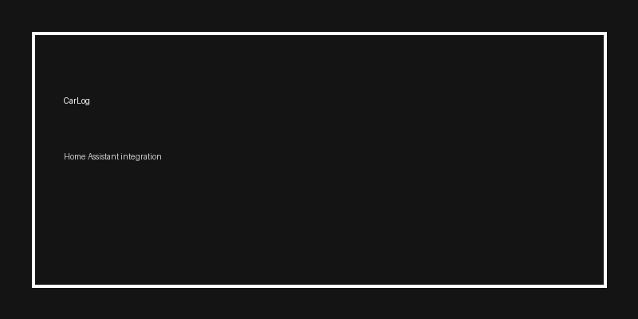

# CarLog

Log tankbeurten en onderhoud voor je auto(’s) in Home Assistant.

## Wat kan dit?
- Tankbeurten loggen: **km-stand**, **liters**, optioneel **totaalprijs**
- Onderhoud loggen: olie / banden / remmen / overig, met optionele datum (ook terug in de tijd)
- Helpers zitten **in de integratie**: invoervelden + knoppen, zodat iedereen het snel kan doen
- Sensors voor:
  - Kilometerstand
  - Gemiddeld verbruik (L/100km)
  - Gemiddelde actieradius (km) als je tankinhoud invult
  - Status “opslaan bezig / saved / error”

## Installatie via HACS (Custom repository)
1. HACS → **Integrations**
2. Menu rechtsboven → **Custom repositories**
3. Voeg de URL van jouw repo toe, categorie **Integration**
4. Installeer **CarLog**
5. Herstart Home Assistant
6. Settings → Devices & Services → Add Integration → **CarLog**

## Handmatig
Kopieer `custom_components/carlog/` naar:
`<config>/custom_components/carlog/` en herstart HA.

## Data opslag
Data staat in:
`.storage/carlog_data`

Tip: maak een backup voordat je handmatig iets aanpast.
